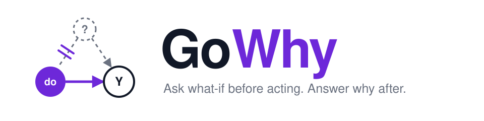
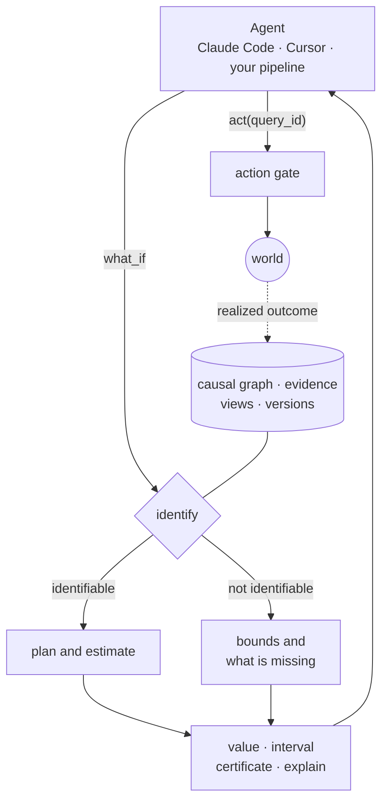

<div align="center">

<picture>
  <source media="(prefers-color-scheme: dark)" srcset="assets/banner-dark.svg">
  
</picture>

### The causal database for AI agents

Your agent reads logs and guesses. GoWhy tells it what an action will **cause**,<br>
and says so plainly when the data cannot answer.

[](#-status-and-roadmap)
[](#-quickstart)
[](#-quickstart)
[](#-plug-it-into-your-agent)
[](https://arxiv.org/abs/2608.07214)
[](#license)

[Demo](#-watch-an-agent-change-its-mind) ·
[Why](#-why) ·
[Quickstart](#-quickstart) ·
[Tools](#-the-tools) ·
[How it works](#-how-it-works) ·
[Roadmap](#-status-and-roadmap) ·
[Design doc](DESIGN.md)

</div>

---

## ⚡ Watch an agent change its mind

An agent wants to raise retention in customer segment B. Its plan is a discount. Before acting, it asks.

```console
$ python3 demo/agent.py                                   # abridged; agent narration in comments

> what_if(set={discount: 1}, outcomes=[retained, refund], where={segment: B})

  retained  +0.030  95% CI [+0.022, +0.037]  IDENTIFIABLE  back-door, adjusted for {loyalty}
            naive log contrast -0.069  (confounded, not a causal effect)
  refund    +0.050  95% CI [+0.045, +0.055]  IDENTIFIABLE  back-door, no adjustment needed
  query_id: q-0001

# +3 points of retention, +5 points of refunds. Net negative: the agent drops the discount
# and asks about free shipping instead.

> what_if(set={free_shipping: 1}, outcomes=[retained, refund], where={segment: B})

  retained  +0.019  95% CI [+0.011, +0.026]  IDENTIFIABLE  back-door, adjusted for {loyalty}
  refund    no effect  IDENTIFIABLE  the graph has no causal path from free_shipping to refund
  query_id: q-0002

> apply_offer(segment=B, offer=free_shipping, query_id=q-0002)

  applied free_shipping to segment B, authorized by q-0002
  retained  realized +0.020   predicted +0.019 [+0.011, +0.026]   inside the interval

# Next idea: proactive support calls. The logs cannot answer this one, and GoWhy says so.

> what_if(set={support_call: 1}, outcomes=[retained], where={segment: B})

  retained  NOT IDENTIFIABLE from orders_log: no point estimate is returned
            reason: support_call and retained share a cause that orders_log does not record (frustration)
            the data alone only say the effect lies in [-0.577, +0.423]
            to answer it: start logging frustration
            to answer it: randomize support_call on 4,448 customers per arm (+/-0.02 at 95%)
            naive log contrast -0.092  (confounded, not a causal effect)

> apply_offer(segment=B, offer=support_call, query_id=q-0003)

  REFUSED: q-0003 could not identify the effect on ['retained']; acting on it would be a guess
```

Three things happened that a log dashboard, a rules file, or an LLM would not have done:

- **The sign flipped.** The raw logs say discounts *reduce* retention by 7 points, because discounts were handed to customers who were already leaving. The causal effect is +3. The simulated world's ground truth is +0.03.
- **It refused to answer.** For support calls there is no number, only the reason, the bounds the data do support, and two concrete ways to make the question answerable.
- **The action was gated and audited.** `apply_offer` runs only with the `query_id` of a what-if that asked about that exact action. `explain(q-0002)` reconstructs the estimand, the assumptions, the provenance of every edge it relied on, and the action it authorized.

## 🤔 Why

Agents leave logs, and everyone reads the logs to decide things: does retrieval help, is the deeper search worth it, which skill broke the run, should the agent have called that tool. But logs are not an experiment. The agent chose to call the tool *after* reading the task, so hard tasks are over-represented among tool calls and the tool gets blamed for the difficulty of the tasks it was handed. The standard fix is to replay trajectories under interventions, at one model run per counterfactual.

| You want to know | Today you use | What goes wrong | With GoWhy |
|---|---|---|---|
| Does this tool, depth, or skill actually help? | Read the logs, or replay | Logs are confounded; replay is expensive | Computed from the logs; replay only where it is provably needed |
| Can this question be answered at all? | Nothing tells you | A library computes what you ask for; an LLM makes something up | `identify` rules first, and tells you what is missing |
| How do I stop the agent doing something harmful? | Rules and prompt text | Rules do not know consequences | The agent asks `what_if` before it acts |
| Whose fault was it? | LLM-as-judge, Shapley over logs | Neither is causal | `attribute` and `why` queries |

## ✨ What you get

**1. Does the tool work? Answered from your own logs, without replay.** &nbsp;`🚧 v0.1`<br>
Point GoWhy at a trace directory. It tells you whether retrieving 3 or 10 documents is better and how much the new tool version helps, with confidence intervals. It also tells you that "should the agent call the tool at all" cannot be answered from logs, and how many replays of the no-tool arm would settle it. This is Theorems 1 and 2 of the *Replay-Free* paper as one command.

**2. `identify`: what cannot be known, and what is missing.** &nbsp;`✅ in the demo`<br>
Ask a causal question and GoWhy first rules: identifiable, partially identifiable, or not. When it is not, you get the variable you failed to log, or the size of the experiment that would answer it. A "not identifiable" verdict is backed by the complete ID algorithm, not by "no adjustment set found".

**3. One line of MCP, and your agent asks before it acts.** &nbsp;`✅ in the demo`<br>
`what_if`, `identify`, and `explain` as MCP tools for Claude Code, Cursor, or any MCP client, with `counterfactual` and `attribute` coming in v0.1. The server is plain standard-library Python.

## 🚀 Quickstart

You need Python 3.9+ with `numpy` and `pandas`. Nothing to install yet; run the demo from the repository.

```bash
python3 demo/agent.py
```

```bash
python3 -m pytest demo/test_demo.py -q
```

`agent.py` is a scripted agent, so no API key is needed. It talks to `demo/server.py` over real MCP stdio. The retail world behind it is simulated with known ground truth, which is how the test suite checks that the intervals cover the true effects.

### 🔌 Plug it into your agent

Add the server to any MCP client:

```json
{
  "mcpServers": {
    "gowhy": { "command": "python3", "args": ["/absolute/path/to/gowhy/demo/server.py"] }
  }
}
```

Or in Claude Code:

```bash
claude mcp add gowhy -- python3 /absolute/path/to/gowhy/demo/server.py
```

Then give the agent a goal:

> You are an operations agent. Raise retention in segment B. The action you can take is `apply_offer`.

There are three ways to wire GoWhy in, in increasing order of force:

| Level | How | If the agent ignores it |
|---|---|---|
| Tool | The agent gains `what_if`, `identify`, `explain` | It may not call them |
| Instruction | The server's instructions say: ask before any world-changing action | It may forget |
| **Gate** | The action tool requires the `query_id` of a matching, identifiable what-if | The action does not run, and every action that does run has an audit trail |

The demo implements the gate.

## 🧰 The tools

| Tool | Question it answers | Status |
|---|---|---|
| `what_if` | If I do X, what happens to Y? Effect, interval, certificate. | ✅ |
| `identify` | Can the data I have answer this? If not, what do I log or run? | ✅ |
| `explain` | Where did that number come from? Estimand, path, assumptions, provenance, authorized actions. | ✅ |
| `counterfactual` | For this one episode, what if it had gone the other way? | 🚧 v0.1 |
| `attribute` | Which component is responsible for the outcome? | 🚧 v0.1 |

Every causal answer has the same shape, and there is no way to get a bare number:

```jsonc
{
  "value": 0.030,                          // null unless the status is "identifiable"
  "interval": [0.022, 0.037],              // confidence interval, or identification bounds
  "certificate": {
    "status": "identifiable",              // identifiable | partial | not
    "strategy": "backdoor",
    "adjustment_set": ["loyalty"],
    "assumptions": ["..."],
    "missing": []                          // log this, randomize that, replay this arm
  },
  "explain": { "estimator": "...", "n": 79796, "seed": 0, "naive_log_contrast": -0.069 }
}
```

## 🔬 How it works



The pipeline below is the v0.1 design. The demo implements one slice of it: a single logged view, back-door estimation, the ID algorithm for the verdict, bounds, the to-do list, and the gate.

1. **The causal graph is data.** Variables, edges, and the evidence behind each edge (experiment, log, expert, discovery) are stored and versioned. A variable can be in the graph without being in your logs; that gap is exactly what `identify` reports.
2. **`identify` is a gate, not a step.** Back-door, then front-door, then the complete ID algorithm; then a support check on the data itself, because structural zeros are invisible to graph criteria.
3. **A planner picks the estimator.** Experiments outrank logs; alternative valid plans are estimated as a cross-check, and disagreement is reported.
4. **No answer without a certificate.** If the effect is not identifiable you get bounds and a to-do list, never a point estimate.
5. **Answers authorize actions, so they are kept.** Facts are append-only, deletion is retraction, and any past answer can be replayed.

The full design is in [DESIGN.md](DESIGN.md); storage semantics in [SPEC-DB.md](SPEC-DB.md); how agent traces map onto the data model in [SPEC-TRACES.md](SPEC-TRACES.md).

<details>
<summary><b>API preview for v0.1</b> (designed, not implemented yet)</summary>

```python
import gowhy

db = gowhy.connect("retail.gowhy")                       # one file, in-process
db.edge("loyalty", "discount", evidence=gowhy.Evidence("expert", "pricing policy v3"))
db.register_view("orders_log", df, kind="observational")
db.register_view("discount_ab", df_ab, kind="experiment", randomized=["discount"])

r = db.what_if({"discount": 1}, outcomes=["retained", "refund"], where={"segment": "B"})
r["retained"].value, r["retained"].interval, r["retained"].certificate.status

db.sql("WHAT IF SET discount = 1 RETURN effect(retained), effect(refund) WHERE segment = 'B'")
db.as_of(version=12).identify("support_call", "retained")
```

```bash
gowhy analyze traces/ --tool retriever --treatment config.depth --mediator output.gold_hits --outcome outcome.correct
gowhy serve --mcp
```

</details>

## 🧭 What GoWhy is not

- **Not an estimation library for statisticians.** DoWhy and EconML are that; they are backends.
- **Not a causal discovery package.** Bring causal-learn, PC, GES, or an expert; GoWhy stores what they find, with provenance.
- **Not a memory layer.** Mem0 and MemOS store what happened; GoWhy stores what causes what.
- **Not a graph database with a causal plugin.** The causal graph is the data model, the causal question is the query, and the agent is the user.

## ❓ FAQ

**Where does the causal graph come from?** You bring it: domain knowledge, a discovery algorithm, past experiments, or the control flow of your agent's code (for traces, the template is structural). GoWhy does not discover graphs. It records where each edge came from and how much to trust it.

**What if my graph is wrong?** Then the answer is wrong, and the certificate tells you which edges it leaned on. Two protections: realized outcomes are compared against the predicted interval after the agent acts (in the demo), and an A/B test or a handful of replays outranks the logs and serves as a cross-check (v0.1).

**Does it call an LLM?** No. Identification and estimation are deterministic given a seed. LLMs are the users, not the engine.

**Why not just replay everything?** Replay costs one model run per counterfactual. For "which configuration is better", logs that record tool outputs are enough. For "should the tool be called at all", they provably are not, and GoWhy tells you how few replays close the gap.

**How does this relate to world models?** A learned world model predicts what follows an action from logged trajectories, so it inherits the confounding in those logs, and an ensemble cannot see that bias because every member agrees on the same wrong answer. GoWhy is the certified counterpart: each prediction says whether it is identified, unsupported, or confounded. The plan (v0.2, see [DESIGN.md §15](DESIGN.md)) is to register an external world model or simulator as a third tier of evidence, cheaper than replay and corrected with a small number of real interventions.

## 🗺 Status and roadmap

This is alpha software. What exists today is the demo and the design.

- [x] Design doc, storage spec, trace spec
- [x] Demo: retail world with ground truth, minimal engine, MCP server, gated action, scripted agent, tests
- [ ] **v0.1** embedded single-file store with versions and `AS OF` · front-door and general ID estimators · query language · `gowhy analyze traces/` · `counterfactual` and `attribute` · `pip install gowhy`
- [ ] **v0.2** logging recommendations for a whole query workload · property-graph `MATCH` · replay budgeting in the planner · OpenTelemetry and LangGraph adapters · world models and simulators as a third evidence tier, with certificates on their predictions
- [ ] **v0.3** multi-step traces · certified skill effects · causal index plugins (FCM, FDCut, TESSERA)
- [ ] **v1.0** mediator: register local views from tables, documents, and experiments; provenance-aware merges

## 📚 Papers

- *Toward a Causal Data Management Ecosystem for Decision Making and Agentic AI.* Qiu, Zhou, Pachera, Bonifati, Mauri. ACM AI Leadership Summit 2026. [arXiv:2608.07214](https://arxiv.org/abs/2608.07214). GoWhy is the reference implementation of the Causal World System described there.
- *Replay-Free: Front-Door Identification of Tool and Retrieval Effects from Agent Logs.* Draft, 2026.
- *Efficient What-If Queries over Large Causal Property Graphs*; *Scalable Front-Door Adjustment for Causal Models.* Under review.

```bibtex
@misc{gowhy2026,
  title  = {GoWhy: A Causal Database for LLM Agents},
  author = {Zhou, Yingli and others},
  year   = {2026}
}
```

## License

Apache-2.0.

Built at CNRS LIRIS within the ERC Advanced Grant GO-Y (no. 101199575), funded by the European Union. Views and opinions expressed are those of the authors only.
